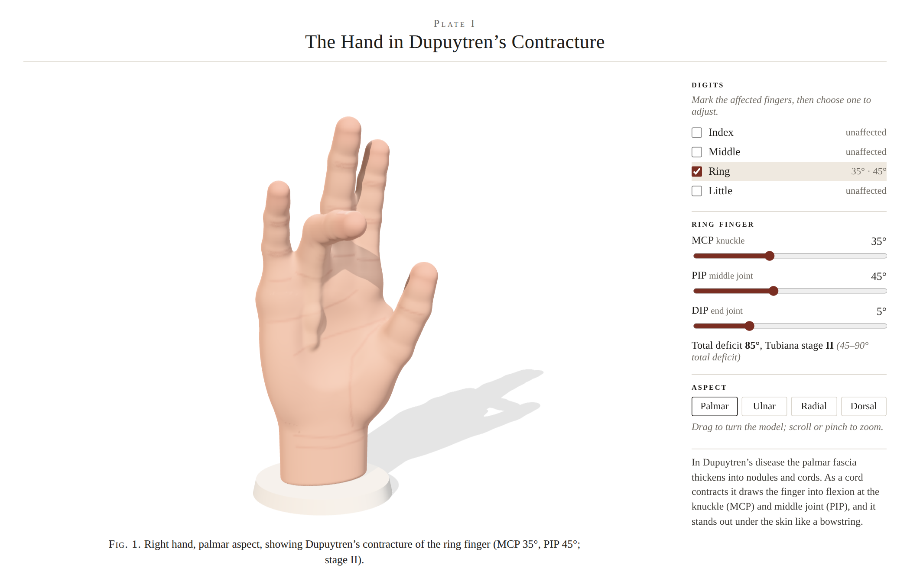
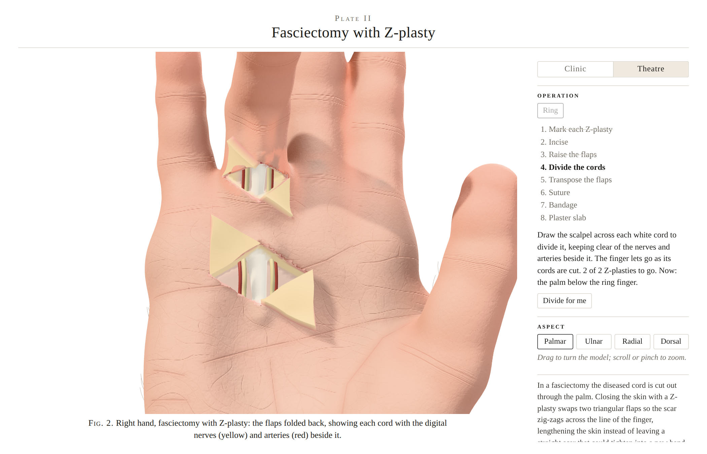

# Dupuytren's Hand

An educational model of a hand with Dupuytren's contracture, drawn in the calm
style of an encyclopaedia plate: a lifelike but clearly modelled right hand on a
white page.

This first milestone is the model itself. Choose which fingers are affected and
dial in the MCP, PIP and DIP flexion; the palmar cord and nodule appear under
the skin and bowstring across the flexed joints, and the panel shows the
Tubiana stage.



**Theatre** mode is the operation, done by hand: a fasciectomy closed with
Z-plasties, one in the palm over each palm cord and one on each finger with a
middle-joint contracture. Mark each Z with the skin marker and cut it with the
scalpel, peel back each triangular flap, draw the scalpel across each cord to
divide it (the finger lets go as you cut), fold the flaps back so they swap
places, sew each stitch, then wind on a crepe bandage and smooth a plaster
slab along the back of the hand. Every step also has a button to do it for you.



## Roadmap

1. **Clinic**: configure the contracture. *Done.*
2. **Theatre**: fasciectomy with Z-plasties, bandage and plaster. *Done, being refined.*
3. **Hand therapy**, over several visits with a hand specialist:
   - cut off the bandage and plaster, and clean the wounds;
   - take out the stitches and look after the scars;
   - mould a thermoplastic splint to hold the fingers straight, worn at night;
   - a programme of exercises across later visits to keep the fingers straight
     and get grip and bend back.

## Running it

```sh
npm install
npm run dev      # http://localhost:5173
npm run build    # static site in dist/
```

Add `?view=ulnar` (or `palmar`, `radial`, `dorsal`) to open on a given aspect,
or `?mode=theatre&step=excise` to jump to a step of the operation.

## How the hand is made

There is no sculpted mesh. The skin is a signed distance field built from
anatomical shapes (tapered phalanges, finger pads, eminences, metacarpals,
webs, the palmar hollow) blended with a smooth minimum, so creases and webs
form naturally for any pose.

- `src/hand/anatomy.ts`: dimensions, finger kinematics and the cord path.
- `src/hand/sdf.ts`: the distance field and the skin colouring (creases, nails, flush).
- `src/hand/mesher.ts`: Surface Nets meshing, sampled finely only near the skin.
- `src/hand/worker.ts`: runs the meshing off the main thread (about a second at full detail).
- `src/hand/skin.ts`: bends the current mesh while a slider is dragged, so the
  finger follows the pointer; the exact mesh replaces it when the pointer settles.
- `src/hand/surgery.ts`: the Z-plasty geometry and how the finger responds once released.
- `src/scene.ts`: lighting, material, plinth and camera, plus the marks drawn on the skin.
- `src/instruments.ts`: scalpel, skin hooks, sutures, and the nerves and arteries in the wound.
- `src/theatre.ts`: the steps of the operation and the theatre panel.
